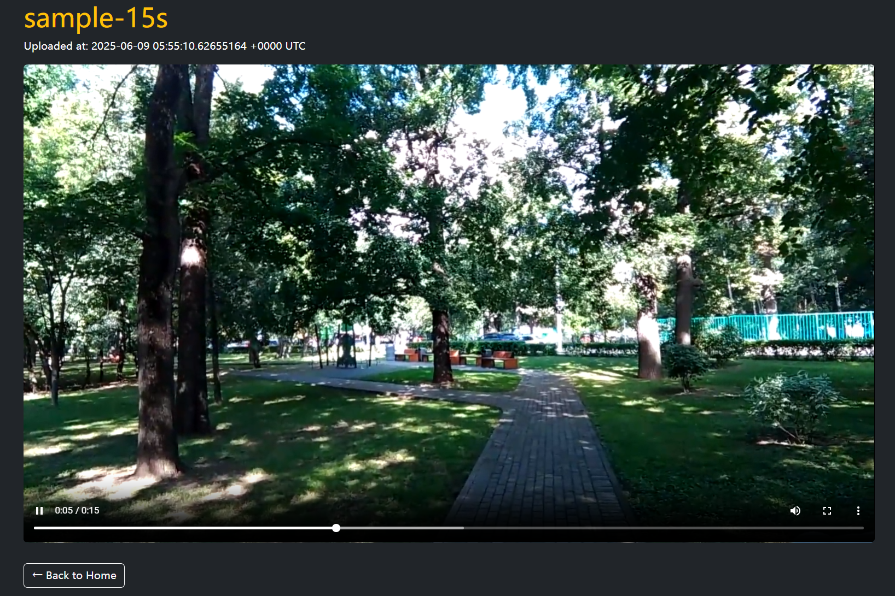

# TritonTube

A distributed video‐streaming platform with adaptive MPEG-DASH playback, pluggable metadata backends, and scalable content delivery, based on UCSD CSE224 25SP final project.

---

## 🚀 Architecture Overview


- **Web Server (Go)**  
  - Upload API → `ffmpeg` packages into DASH segments  
  - Pluggable metadata: SQLite or etcd (Raft consensus across EC2)  
  - ContentService: Local FS / AWS EFS shared mount / gRPC + consistent hashing
  - Admin gRPC → dynamic node add/remove + zero-downtime migrations  

- **Metadata**  
  - SQLiteVideoMetadataService: local **SQLite** database for metadata storage  
  - EtcdVideoMetadataService: **etcd** (multiple nodes Raft) clientv3 for Go → high availability, strong consistency

- **Content Delivery**  
  - FSVideoContentService: **Local FS** or **AWS EFS** shared file system (mount `/mnt/efs/storage`)  
  - NetworkVideoContentService: **gRPC** network service with consistent hashing for on-the-fly scaling  

- **Frontend UI**  
  - Server-rendered Go templates + Bootstrap + Vue.js  
  - AJAX upload with real-time progress bar  
  - dash.js for MPEG-DASH playback  

## 🛠️ Quickstart

### Prerequisites

- Go 1.24+  
- etcd cluster (or single‐node) running on ports `2379` (client),  `2380` (peer)  
- (Optional) AWS EFS mount at `/mnt/efs/storage`
- `ffmpeg` installed

### 1. (For EtcdVideoMetadataService) Start etcd

```bash
# On each etcd node:
etcd \
  --data-dir=data.etcd --name node1 \
  --initial-advertise-peer-urls http://<IP>:2380 --listen-peer-urls http://<IP>:2380 \
  --advertise-client-urls http://<IP>:2379 --listen-client-urls http://<IP>:2379 \
  --initial-cluster node1=http://<IP>:2380,node2=... \
  --initial-cluster-state new
```

### 2. Mount Shared Storage (AWS EFS)
```bash
sudo yum install -y amazon-efs-utils
sudo mkdir -p /mnt/efs/storage
sudo mount  -t efs -o tls fs-XXXXXXX:/ /mnt/efs/storage
sudo chown $USER:$USER /mnt/efs/storage
```

### 3. (For NetworkVideoContentService) Start Storage Nodes
```go
go run cmd/storage/main.go \
  -host localhost -port <port number> \
  /mnt/efs/storage

...

Repeat on other machines with different ports.
```

### 4. Lauch Web & Admin Server Example
```go
go run cmd/web/main.go \
  -port 8080 \
  sqlite ./metadata.db \ or etcd "<IP1>:2379,<IP2>:2379, <IP3>:2379, ..."
  fs /mnt/efs/storage or nw "localhost:8081,localhost:8090,localhost:8091, localhost:8092, ..."
```

###  5. (For NetworkVideoContentService, Optional) Use Admin CLI
```go
# List nodes
go run cmd/admin/main.go list localhost:8081

# Add a node
go run cmd/admin/main.go add localhost:8081 localhost:8090

# Remove a node
go run cmd/admin/main.go remove localhost:8081 localhost:8090
```

### 6. Browse & Test
* Visit http://`<public IP address>`:8080/

* Upload an MP4 → Watchlist appears with progress bar


* Click a video → DASH playback via dash.js

